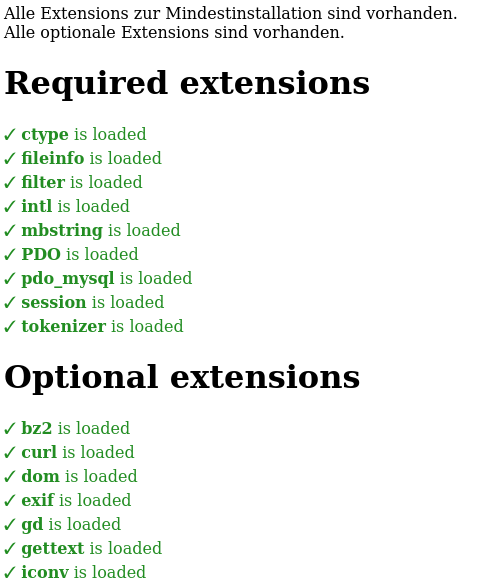

# :robot: Was macht es?

Prüft das Vorhandensein von benötigten PHP-Extensions für Redaxo 5.15.1.  
Mindestens PHP 8.2 sollte vorhanden sein.

# :mag: Wofür ist das gut?

Zeigt fehlenden PHP-Extensions an.

## Mindestens benötigte Extensions

`ctype, fileinfo, filter, intl, mbstring, PDO, pdo_mysql, session, tokenizer`

Diese werden vom Redaxo-Core mindests zur Installtion benötigt. Beachte die Anmerkung zur Extension `gd` (benötigt vom `media_manager`).

## Optionale Extensions

`bz2, curl, dom, exif, gd, gettext, iconv, imagick, libxml, openssl, pcntl, Phar, posix, SimpleXML, xdebug, xml, Zend OPcache, zip, zlib`

Diese werden teils durch Redaxo selbst, teils ausschließlich von Vendoren (befinden sich in Verzeichnissen `vendor`) verwendet. Einige davon werden durch alternative Funktionen ersetzt, wenn sie nicht vorhanden sind.

### Hinweis / ACHTUNG
`pcntl` - Momentan wird dieses Modul nicht auf Plattformen funktionieren, die nicht auf Unix basieren (Windows). [Siehe: Prozesskontrolle](https://www.php.net/manual/de/pcntl.installation.php)

Beachte auch:
> Prozesskontrolle sollte nicht innerhalb einer Webserverumgebung aktiviert werden und unerwartete Ergebnisse können auftreten, wenn eine Prozesskontrollfunktion innerhalb einer Webserverumgebung verwendet wird. 

Daher wird diese Extension **NICHT** abgefragt.

# :eye: Wie nutzen?

Aufruf der Datei über den Browser oder in der Konsole. Beachte den Hinweis unter Einstellungen.

## Hinweis

Der Aufruf kann auch in der Konsole erfolgen. Aber Achtung! Der Konsolenaufruf bringt je nach Installation unter Umständen eine andere Ausgabe, als der Aufruf über den Browser!


# :hammer_and_wrench: Einstellungen

Es gibt 3 Einstellungen.  
Die Ausgabe kann einfach und/oder bunt und/oder mit PHP_INFO erfolgen.

Die einfache Ausgabe ist u.a. für den Aufruf in der Konsole gedacht. Der Konsolenaufruf bringt je nach Installation unter Umständen eine andere Ausgabe, als der Aufruf über den Browser!

0 = Ausgabe erfolgt nicht  
1 = Ausgabe erfolgt

```php
$Ausgabe_Einfach = 1;
$Ausgabe_Bunt = 1;
$Ausgabe_PHPINFO = 0;
```

# :point_right: Wichtiger Hinweis

Das Addon `media_manager` benötigt die Extension `gd`.
Diese Extension ist aber keine vom Core unbedingt benötigte Extension. Sollte die Extension fehlen, muss in der Datei `redaxo/src/core/default.config.yml` im Bereich `system_addons:` das Addon `media_manager` durch setzen des `"#"` als Kommentar markiert und damit vom Setup ausgeschlossen werden.

Die Ermittlung der benötigten Extensions für Redaxo wurde mit Hilfe dieses Scriptes ermittelt: 
[PHP Extension Dependency Detector](https://github.com/RogerGee/php-ext-depends)


# :copyright: Der Originalhinweis

Beachte die Anmerkungen zur Ermittlung der Extensions unter [PHP Extension Dependency Detector](https://github.com/RogerGee/php-ext-depends)

Auslöser des Ganzen waren diese 2 Issues:  
[Setup / add extension check 'gd'](https://github.com/redaxo/redaxo/pull/5750) und [Mindestanforderungen im Setup unterscheiden sich von Angaben der Downloadseite](https://github.com/redaxo/redaxo/issues/5767)

# :framed_picture: Beispielansicht


